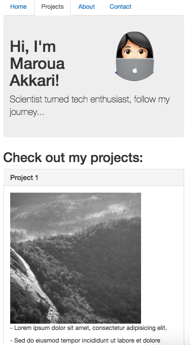

# Sparta Site Project

The brief for this task was to make a website that:
1. Has at least 3 pages
2. Has a navbar
3. Is styled with Bootstrap
4. Is responsive for at least large and small sized screens

This site is made up of 4 pages: Index, About, Projects, Contact.

In the html `<head>` tag links to the Bootstrap css and JavaScript files need to be included, as well as my own css file after the Bootstrap version.

Bootstrap was used to structure the page using `rows` and `columns` as well as built in classes like `jumbotron`

The column classes were modified to make the site responsive for a small and large screen e.g. `col-sm-12` to make something fill the whole row, and `col-lg-6` to have two items sitting next to each other in one row, respectively.

 ### My Projects page on a large screen:
 

 On a large screen, 2 projects are shown per row

 ### My Projects page on a small screen:
 

 On a small screen, each project takes up the whole row for better user viewing. 
